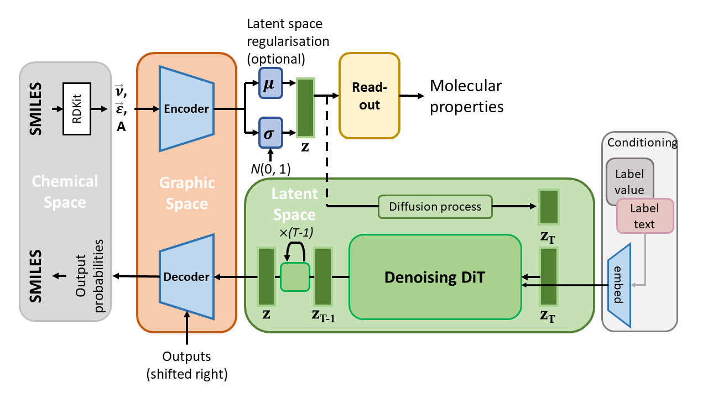

# A<span style='color:#CB4154'>k</span>Ane: bidirectionary model that predicts molecular properties and generates molecular structures


Proudly made in .



## Web APP
First download the compiled models (`torchscript_model.7z`) from the [release](https://github.com/Augus1999/AkAne/releases) and extract the folder `torchscript_model` to the same directory of `app.py`. Then you can run `$ python app.py` to launch the web app locally.

A demo is being hosted on [hugging face Spaces](https://huggingface.co/spaces/suenoomozawa/AkAne).

## Trained models
We provide pre-trained autoencoder, prediction models trained on MoleculeNet benchmark (including ESOL, FreeSolv, Lipo, BBBP, BACE, ClinTox, HIV), QM9, PhotoSwitch, AqSolDB, CMC value dataset, and an arange deep eutectic solvents (DES) properties, and 2 generation models that generate protein ligands and DES pairs, respectively.

You can download trained models from the [release](https://github.com/Augus1999/AkAne/releases).

## Dataset format
The datasets we used and provided are stored in CSV files. We provide a python class `CSVData` in [akane2/utils/dataset.py](akane2/utils/dataset.py) to handle these files which require a header with the following tags:
* __smiles__ (_mandatory_): the entities under this tag should be molecule SMILES strings. Multiple tags are acceptable.
* __temperature__ (_optional_): the temperature in kelvin. Providing more than one this tag won't cause any error but only the last one will be accepted.
* __ratio__ (_optional_): molar ratio of each compound in the format of `x1:x2:...:xn`.  Providing more than one this tag won't cause any error but only the last one will be accepted.
* __value__ (_optional_): entities under this tag should be molecular properties. Multiple tags are acceptable and in this case you can tell `CSVData` which value(s) should be loaded by specifying `label_idx=[...]`. If a property is not defined, leave it empty and the entity will be automatically masked to `torch.inf` telling the model that this property is unknown. 
* __seq__ (_optional_): FASTA-style protein sequence. Providing more than one this tag won't cause any error but only the last one will be accepted. NOTE THAT WHEN THIS TAG IS USED, MOLECULAR PROPERTIES (IF PRESENT IN THE FILE) WILL NOT BE LOADED.

These tags are unnecessary to be ordered, e.g.,
```csv
smiles,value,value,ratio,smiles
```
and
```csv
smiles,smiles,ratio,value,value
```
are both okey.

## Known issue
You cannot compile 2 or more AkAne models (i.e., `akane2.representation.AkAne`) into TorchScript modules together in one file. We recommend to save the compiled models before hand and load by `torch.jit.load(...)`.